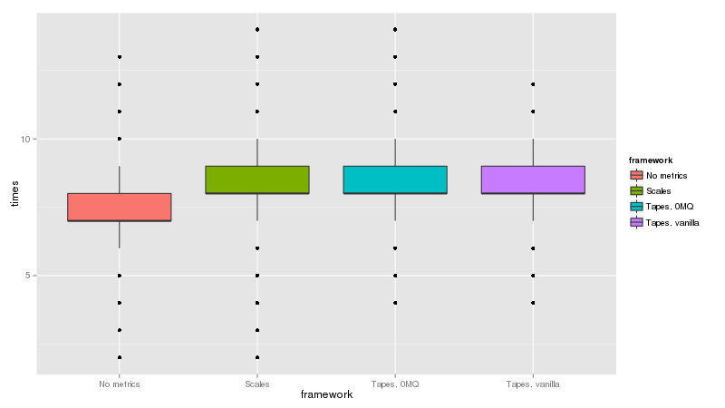
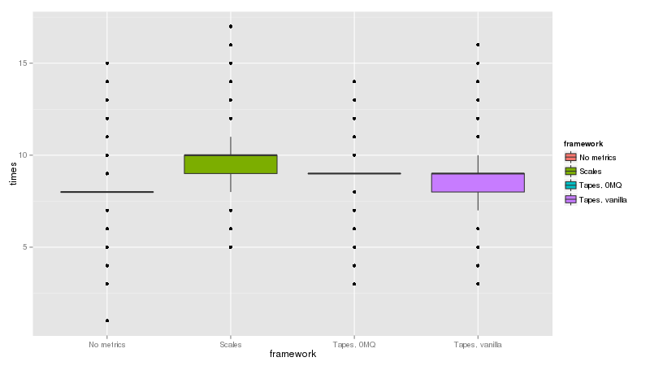
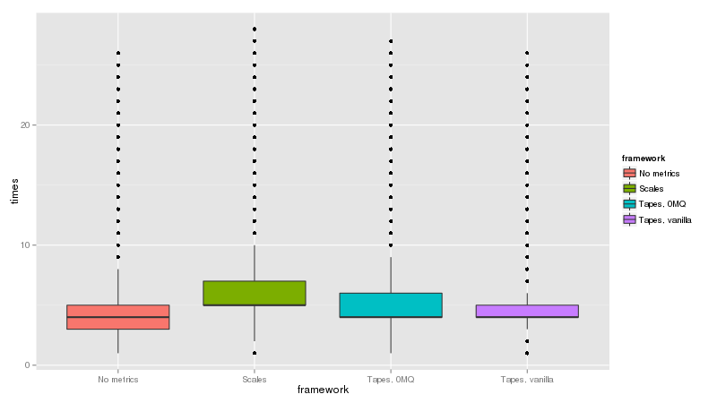
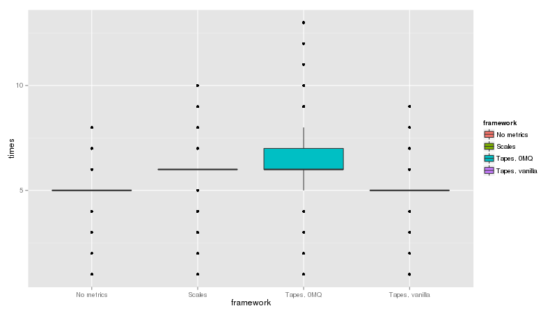
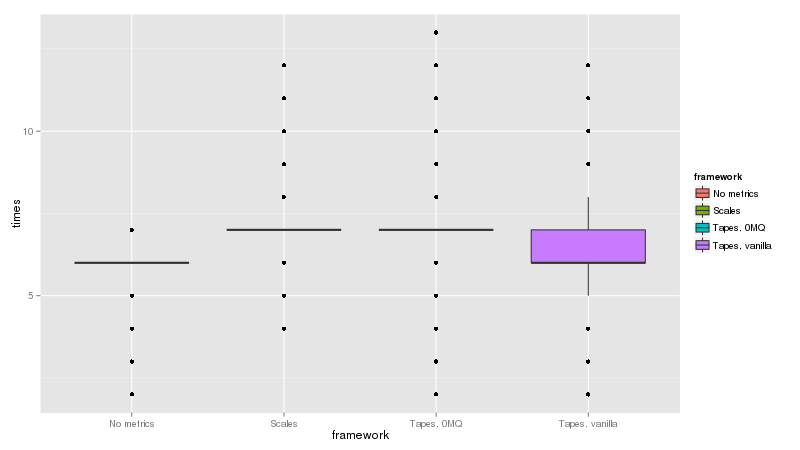
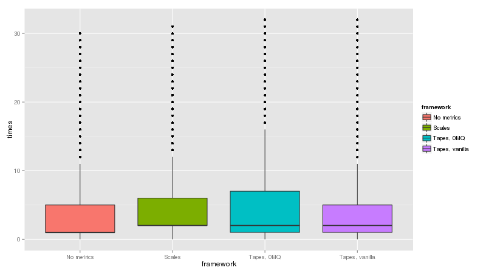
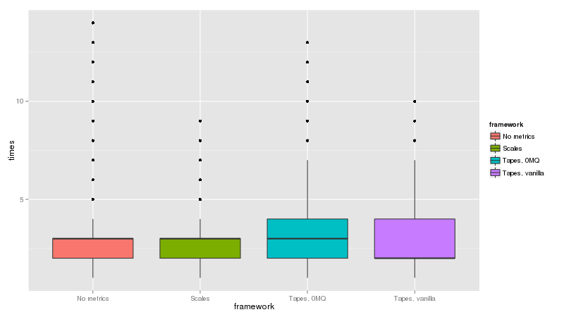
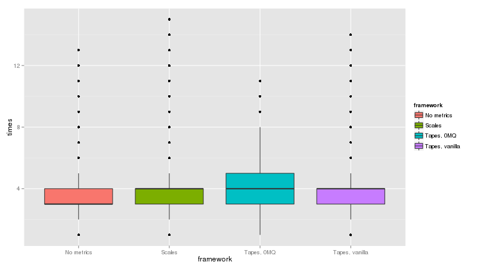
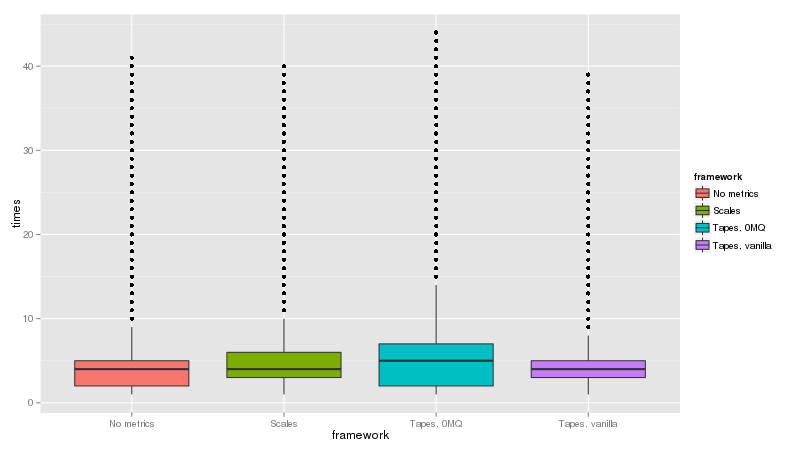

==========
Benchmarks
==========

The benchmarking scripts are in the source code and have ``tox`` environments defined for Python 2.7, 3.4 and PyPy.
All you need to do to run them yourself is check out the code and run::

    tox -e benchmark-py27,benchmark-py34,benchmark-pypy

The results shown here are from an old-ish i5 laptop and are by no means 100% conclusive. With that said...

Flask
=====

Python 2.7
----------

Python 3.4
----------

PyPy 2.4
--------

Tornado, single process
=======================

Python 2.7
----------

Python 3.4
----------

PyPy 2.4
----------

Tornado, forked processes
=========================

Python 2.7
----------

Python 3.4
----------

PyPy 2.4
--------

